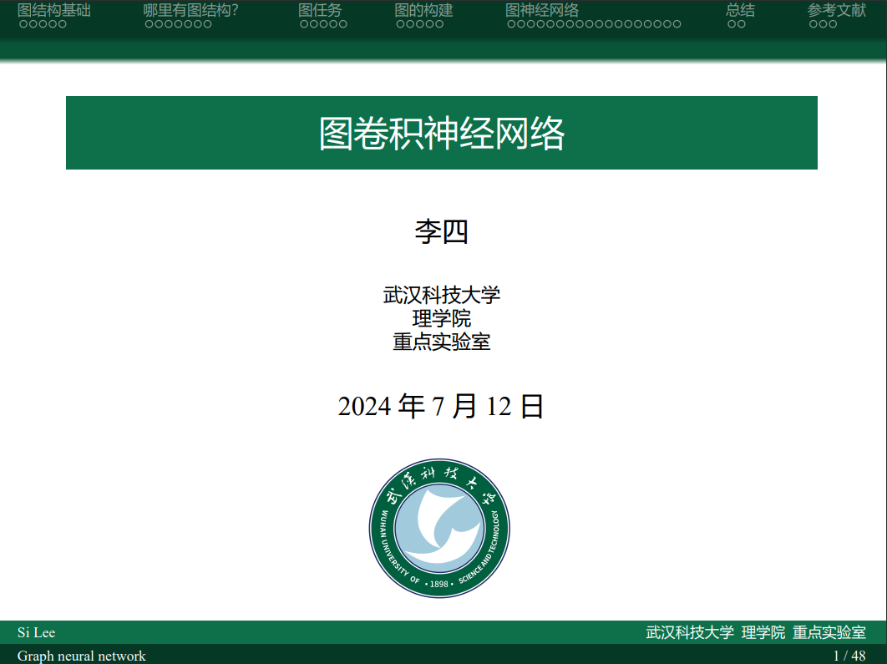
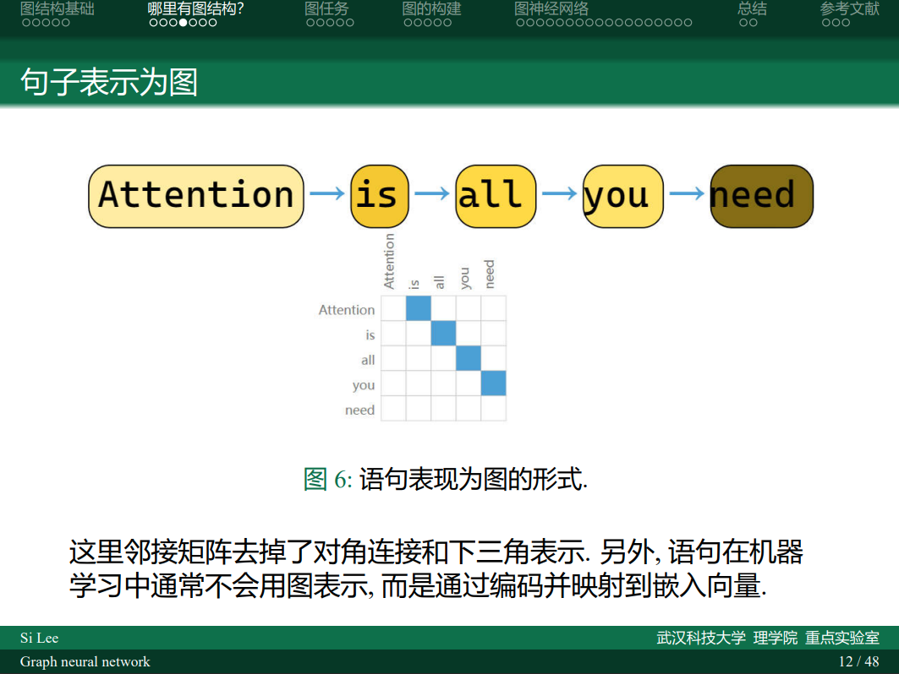
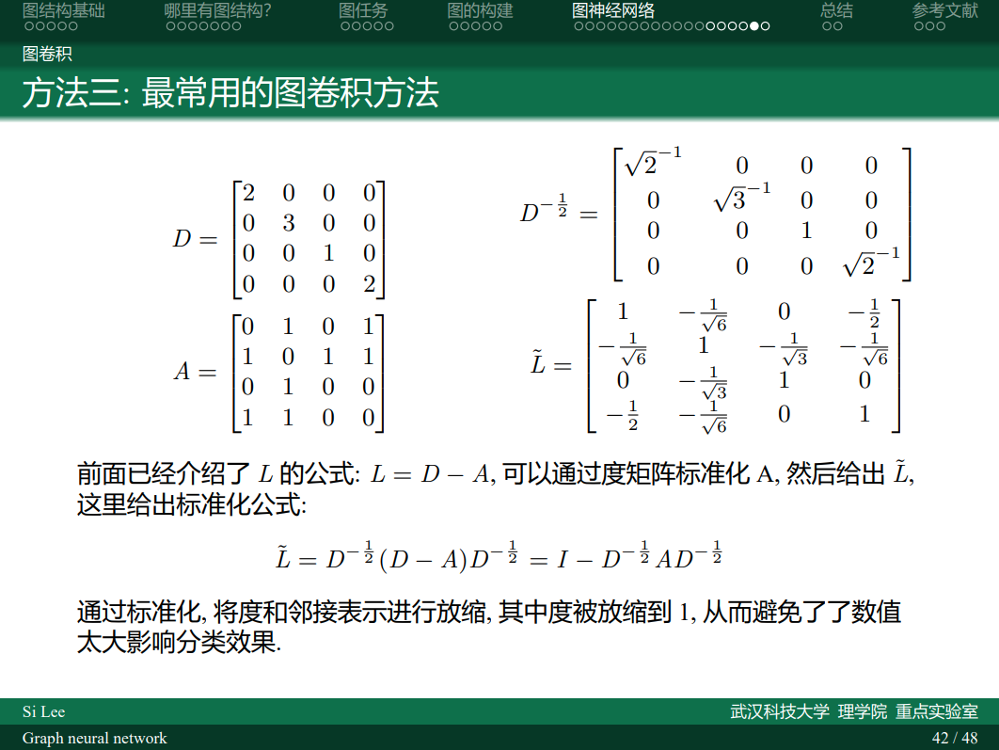

# 武汉科技大学 Beamer 主题

用 Latex 的 Beamer 制作的幻灯片是学术会议中的常客，它以简洁美观著称，现在您只需要赶快 star 或者 fork 这个仓库，就可以将轻松获得拥有武汉科技大学沁湖蓝、青山绿的特色配色的标准 Beamer 模板！这是武汉科技大学师生的免费午餐，是教授和大牛的视觉享受和审美冲击。使用此模板，您将轻松成为 Winner。从现在开始，任何报告或答辩都会对您皱巴巴的牛仔裤、衣服低头。

本项目修改自[新版大连理工大学主题](https://github.com/fuujiro/DLUT-Beamer-Slide-V2)和[清华大学主题](https://github.com/tuna/THU-Beamer-Theme)。

## 编译方法

在latex编译时采用 `xelatex-bibtext-xelatex*2`, 否则存在报错.

## 内容说明

- ref.bib 整理参考文献，在引用论文时把bib格式的cite放在这里
- slide.tex 幻灯片tex文件，在这里编辑幻灯片主要内容
- WUST.sty 武汉科技大学主题配置文件
- pic文件夹 用于存放图片，原本存放图片均为展示用途，可删除
- 如有其他文件为编译中间文件，非必要

## 该模板适用于:

- 本科、研究生和博士论文答辩
- 学术报告和国际会议
- 社团活动和班级活动
- 追求您最喜欢的学弟学妹（不是

## 要使用此模板，您需要：

- 一点点编程技能
- 一点点LaTeX经验
- 不怕丢脸

## 内容展示

### 封面

### 内容

